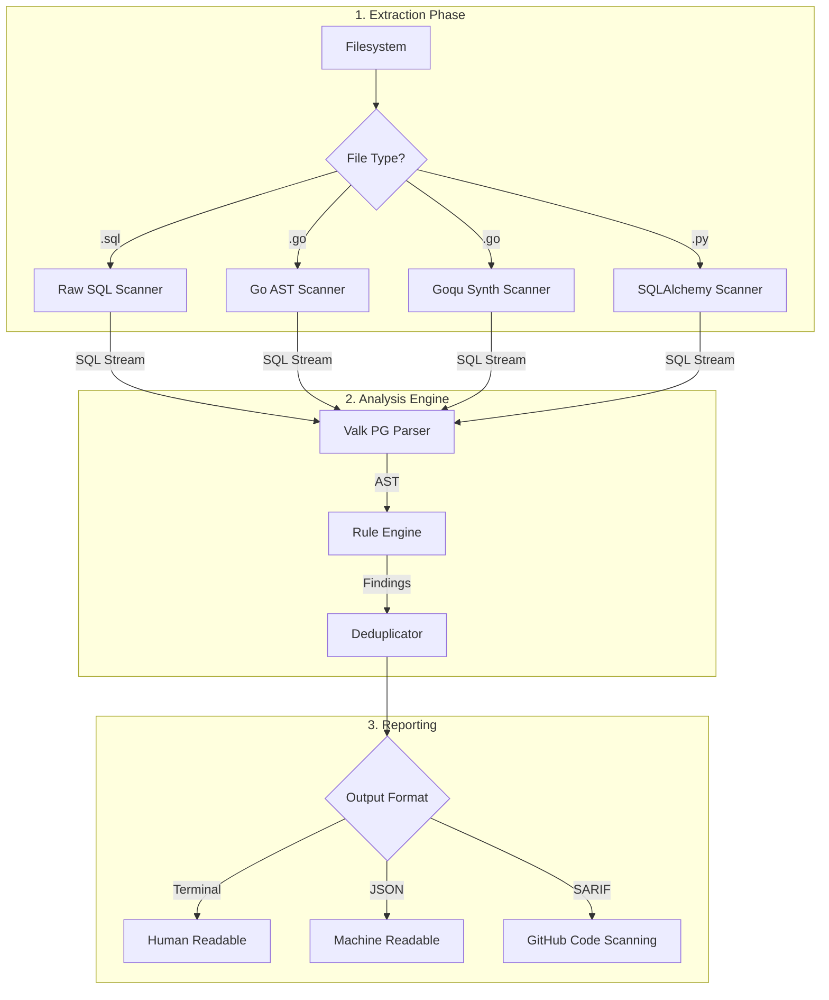
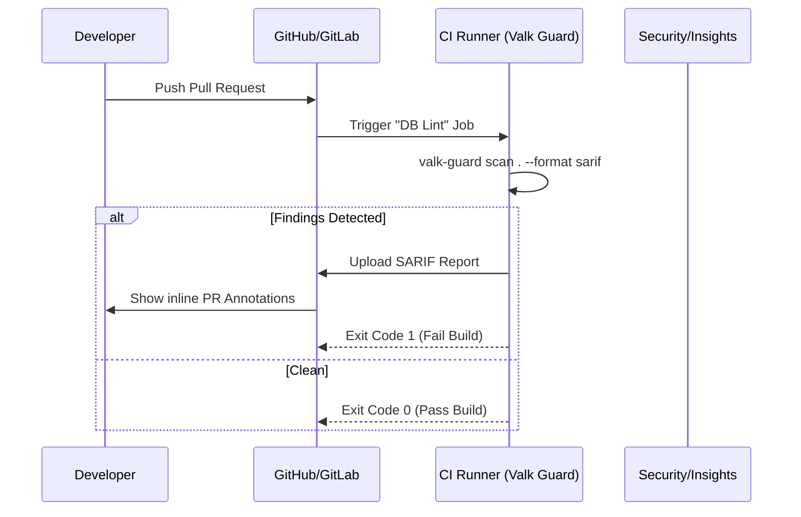

# Valk Guard Overview

**Valk Guard** is an open-source database performance linter for CI/CD. It statically analyzes SQL in your source code to flag performance anti-patterns and safety "footguns" before they hit production.

---

## 🚀 What It Does

Valk Guard acts as a static gatekeeper for your database. It scans your codebase (Go, Python, SQL), extracts database interactions, parses them using a formal PostgreSQL grammar, and runs them against a suite of performance-focused rules.

### Core Value Proposition
- **Prevent Outages**: Catch `UPDATE` or `DELETE` statements missing a `WHERE` clause.
- **Optimize Performance**: Identify `SELECT *` and unbounded queries (missing `LIMIT`).
- **Index Efficiency**: Flag `LIKE` patterns with leading wildcards that bypass indexes.
- **Safe Migrations**: Ensure indexes are created `CONCURRENTLY` to avoid table locks.

---

## 🏗 Technical Architecture

Valk Guard is built for speed and accuracy, leveraging Go 1.25+ features like iterators for memory-efficient streaming.



---

## 🛠 Supported Scanners

| Scanner | Method | Description |
| :--- | :--- | :--- |
| **Raw SQL** | Character Stream | Parses `.sql` files, respecting comments, dollar-quoting, and nested blocks. |
| **Go Standard** | `go/ast` | Extracts SQL literals from `db.Query`, `db.Exec`, `sqlx`, etc. |
| **Goqu** | Synthesis | Analyzes Goqu method chains to generate synthetic SQL for analysis. |
| **SQLAlchemy** | Python AST | Invokes a Python sub-process to extract SQL from `text()` and ORM chains. |

---

## 📋 Built-in Rules

Valk Guard ships with a set of "production-first" rules:

| ID | Name | Severity | Catch |
| :--- | :--- | :--- | :--- |
| **VG001** | `select-star` | Warning | Usage of `SELECT *` instead of specific columns. |
| **VG002** | `missing-where-update` | Error | `UPDATE` statements without a `WHERE` clause. |
| **VG003** | `missing-where-delete` | Error | `DELETE` statements without a `WHERE` clause. |
| **VG004** | `unbounded-select` | Warning | `SELECT` without `LIMIT` (exempts aggregate/dual queries). |
| **VG005** | `like-leading-wildcard` | Warning | `LIKE '%...'` patterns that prevent index usage. |
| **VG006** | `select-for-update-no-where` | Error | Locking entire tables with `FOR UPDATE` (exempts `LIMIT`). |
| **VG007** | `destructive-ddl` | Error | `DROP` or `TRUNCATE` commands in application code. |
| **VG008** | `non-concurrent-index` | Warning | Creating indexes without `CONCURRENTLY`. |

---

## 🔄 CI/CD Workflow

Valk Guard is designed to be a "blocking" step in your CI pipeline.



---

## ⚙️ Configuration

Control Valk Guard via a `.valk-guard.yaml` file:

```yaml
exclude:
  - "vendor/**"
  - "db/migrations/*.gen.sql"

rules:
  VG001:
    enabled: true
    severity: error
  VG004:
    enabled: false
```

### Inline Suppression
You can disable rules for specific lines using comments:
- **SQL**: `-- valk-guard:disable VG001`
- **Go**: `// valk-guard:disable VG001`
- **Python**: `# valk-guard:disable VG001`
