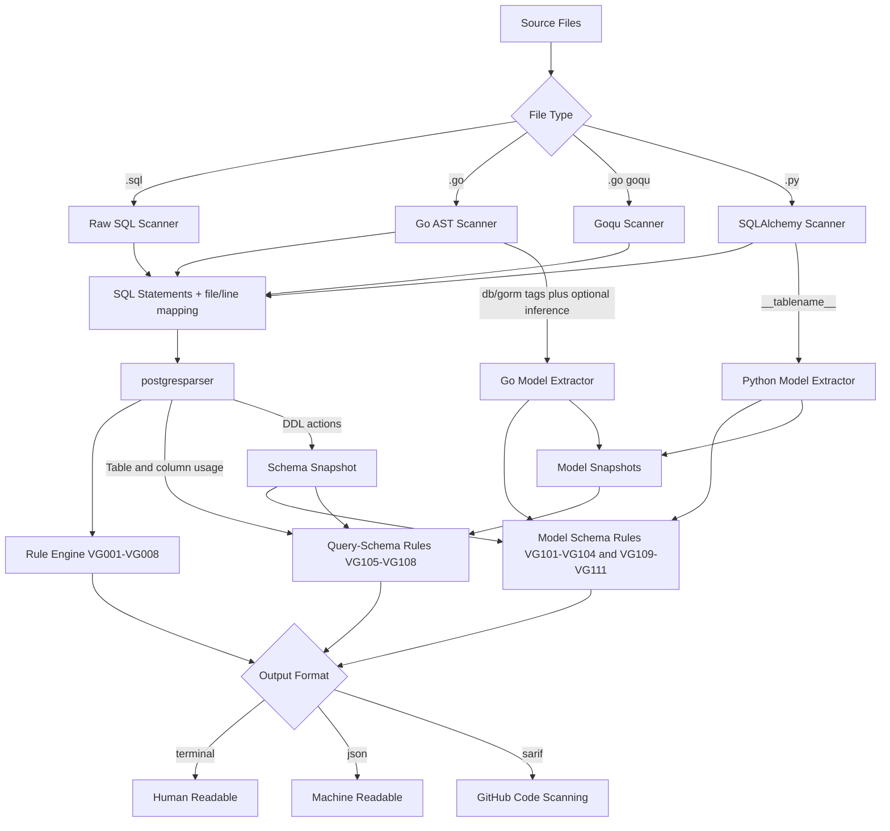

# Valk Guard

[](https://github.com/ValkDB/valk-guard/actions/workflows/ci.yml)
[](https://go.dev/)
[](LICENSE)
[](https://goreportcard.com/report/github.com/valkdb/valk-guard)
[](https://pkg.go.dev/github.com/valkdb/valk-guard)

CI performance linter for application SQL — **PostgreSQL only**.

> **PostgreSQL only.** Valk Guard uses a PostgreSQL parser and exclusively supports the PostgreSQL SQL dialect. MySQL, SQLite, and other dialects are not supported.

## What It Does
- Scans SQL in raw `.sql` files, Go source (`go/ast` extraction), Goqu chains, and Python SQLAlchemy code.
- Parses each statement with [`postgresparser`](https://github.com/ValkDB/postgresparser) (PostgreSQL dialect only) into structured query metadata.
- Applies built-in rules `VG001` through `VG008` to detect performance and safety anti-patterns.
- Cross-references ORM models against migration DDL with rules `VG101` through `VG104`, `VG109` through `VG111` to detect schema drift and mapping risks.
- Validates projected/filter/join/table references in queries against migration DDL with rules `VG105` through `VG108`.
- Reports findings in terminal, JSON, or SARIF 2.1.0 format.
- Uses CI-friendly exit codes: `0` (clean), `1` (findings), `2` (config/runtime/parser error).

## Why It Exists
We already review application code in PRs, but we often do not review the SQL that code generates.  
Valk Guard adds a practical gate for SQL regressions so common DB footguns are caught before production.

## Features (Today)

### Scanner Coverage (v1)
Valk Guard v1 supports all three target sources out of the box:
- Raw SQL files (`.sql`)
- Goqu query-builder usage
- Python SQLAlchemy usage

### Raw SQL Scanner
- Splits multi-statement SQL safely (handles comments, strings, dollar-quoted blocks, nested block comments).
- Preserves source file and statement line mapping for accurate findings.

### Go Scanner (`go/ast`)
- Extracts SQL literals from common DB execution methods (`Query`, `Exec`, `QueryRow`, context variants, and more).
- Applies inline suppression directives from Go comments.

### Goqu Scanner
- Extracts raw SQL from `goqu.L("...")`.
- Generates synthetic SQL from builder chains (`From/Join/Where/Limit/ForUpdate/Update/Delete`) so rules run without raw literals.

### SQLAlchemy Scanner
- Extracts raw SQL from `text("...")` and `.execute("...")`.
- Generates synthetic SQL from ORM/query chains (`query/select/join/filter/filter_by/with_for_update/update/delete`).

### Configuration and Suppression
- Per-rule enable/disable and severity override in `.valk-guard.yaml`.
- File/path exclusion with glob support (`*` and `**`).
- Inline suppressions for SQL, Go, and Python.

### Runtime Behavior
- Parallel scanner execution across SQL, Go, Goqu, and SQLAlchemy inputs.
- Source integrations are wired through scanner/model bindings (`cmd/valk-guard/source_bindings.go`) rather than hardcoded runtime switches.
- End-to-end context cancellation (for `Ctrl+C` and CI timeout behavior).
- Strict parsing behavior: invalid SQL or unparseable candidate Go/Python source fails the run with exit code `2`.
- Parse failures include remediation guidance (`exclude` pattern in `.valk-guard.yaml`).
- Schema snapshot is built from SQL files under migration-like paths (`migrations/`, `migration/`, `migrate/`) when present, otherwise falls back to all scanned `.sql` files.
- Go model extraction uses a provider pipeline (`db` tags, `gorm` tags, optional inference) with configurable mapping mode (`strict`, `balanced`, `permissive`).
- Schema table matching is exact (case-insensitive), without pluralization heuristics.
- Terminal output is plain text.
- Schema-aware checks:
  - `VG101`-`VG104`, `VG109`-`VG111` run when ORM models are present.
  - `VG105`-`VG108` run against parsed SQL statements (`sql`, `go`, `goqu`, `sqlalchemy`) using migration schema, plus engine-matched models when available (`go/goqu` -> Go model extractor, `sqlalchemy` -> SQLAlchemy models).

## Installation

### Requirements
- Go `1.25.6`
- Python `3.x` (only required if scanning SQLAlchemy/Python files)

### Build From Source (recommended for current v1 work)
```bash
git clone https://github.com/ValkDB/valk-guard.git
cd valk-guard
make build
make install
```

### Optional: Install via Go Tooling
Use this for released module versions:

```bash
go install github.com/valkdb/valk-guard/cmd/valk-guard@latest
```

## Quick Start
```bash
# Scan current directory
valk-guard scan .

# JSON output
valk-guard scan . --format json

# SARIF output for CI/code scanning
valk-guard scan . --format sarif --output results.sarif

# Use a custom config
valk-guard scan . --config .valk-guard.yaml

# Enable debug logs
valk-guard scan . --log-level debug
```

## Configuration
Use `.valk-guard.yaml` to tune scanning behavior:

```yaml
format: terminal

exclude:
  - "vendor/**"
  - "db/migrations/**"
  - "*.gen.sql"

go_model:
  mapping_mode: strict # strict | balanced | permissive

rules:
  VG001:
    enabled: true
    severity: warning
    engines: [all] # all | sql | go | goqu | sqlalchemy
  VG005:
    engines: [goqu, sqlalchemy]
  VG007:
    enabled: false
```

Config controls:
- `rules.<RULE_ID>.enabled`: enable/disable a rule.
- `rules.<RULE_ID>.severity`: override severity (`error`, `warning`, `info`).
- `rules.<RULE_ID>.engines`: restrict a rule to specific engines (`all`, `sql`, `go`, `goqu`, `sqlalchemy`). Allowed engine names are validated against `internal/scanner/engines.go`.
- `go_model.mapping_mode`:
  - `strict`: explicit column mappings only
  - `balanced`: infer exported Go fields when explicit mapping is missing
  - `permissive`: infer all named Go fields when explicit mapping is missing
- Mapping provenance (`explicit` vs `inferred`) is attached to extracted table/column mappings:
  - `explicit`: declared by source metadata (for example `db`/`gorm` tags, `TableName()`, `__tablename__`)
  - `inferred`: derived from naming fallback (for example struct/class name or field name inference)
  - Used by schema rules: `VG104` only checks explicit table mappings; `VG111` warns when Go table mapping is inferred.
- `exclude`: skip matching paths/files from scanning.
- Output file path is configured at runtime with `--output <file>`.

Reference example: [`.valk-guard.yaml.example`](.valk-guard.yaml.example)

## Inline Suppression
Directive syntax:
- SQL: `-- valk-guard:disable ...`
- Go: `// valk-guard:disable ...`
- Python: `# valk-guard:disable ...`

Examples:

```sql
-- valk-guard:disable VG001
SELECT * FROM users;
```

```go
// valk-guard:disable VG001
db.Query("SELECT * FROM users")
```

```python
# valk-guard:disable VG001
session.execute(text("SELECT * FROM users"))
```

Disable all rules for the next statement:

```sql
-- valk-guard:disable
SELECT * FROM orders;
```

## Built-in Rules
| Code  | Name                       | Description                                                | Default Severity |
|-------|----------------------------|------------------------------------------------------------|------------------|
| VG001 | select-star                | Detects `SELECT *` projections.                            | warning          |
| VG002 | missing-where-update       | Detects `UPDATE` statements without `WHERE`.               | error            |
| VG003 | missing-where-delete       | Detects `DELETE` statements without `WHERE`.               | error            |
| VG004 | unbounded-select           | Detects `SELECT` statements without `LIMIT`/`FETCH`.       | warning          |
| VG005 | like-leading-wildcard      | Detects `LIKE`/`ILIKE` predicates with leading wildcard.   | warning          |
| VG006 | select-for-update-no-where | Detects `SELECT ... FOR UPDATE` without `WHERE`.           | error            |
| VG007 | destructive-ddl            | Detects destructive DDL (`DROP`, `TRUNCATE`, etc.).        | error            |
| VG008 | non-concurrent-index       | Detects `CREATE INDEX` without `CONCURRENTLY`.             | warning          |

### Model Schema-Drift Rules
| Code  | Name                       | Description                                                | Default Severity |
|-------|----------------------------|------------------------------------------------------------|------------------|
| VG101 | dropped-column             | Model references a column not found in migration schema.   | error            |
| VG102 | missing-not-null           | NOT NULL column (no default) missing from model.           | warning          |
| VG103 | type-mismatch              | Column type mismatch between model and migration DDL.      | warning          |
| VG104 | table-not-found            | Explicit model table mapping has no CREATE TABLE in migrations. | error        |
| VG109 | orphan-migration-table     | Migration table has no matching model mapping.                  | warning      |
| VG110 | duplicate-model-column-mapping | Model maps the same DB column multiple times.               | warning      |
| VG111 | go-inferred-table-name-risk | Go model relies on inferred mapping without explicit table mapping. | warning |

### Query-Schema Rules
| Code  | Name                       | Description                                                | Default Severity |
|-------|----------------------------|------------------------------------------------------------|------------------|
| VG105 | unknown-projection-column  | SELECT projection references a column missing in schema sources (migrations and engine-matched models). | error |
| VG106 | unknown-filter-column      | WHERE/JOIN/GROUP BY/ORDER BY references a column missing in schema sources (migrations and engine-matched models). | error |
| VG107 | unknown-table-reference    | FROM/JOIN references a table missing in schema sources.    | error            |
| VG108 | ambiguous-unqualified-column | Unqualified column is ambiguous across joined tables.    | warning          |

Schema-aware details and examples: [`docs/schema-drift.md`](docs/schema-drift.md)

### Schema-Drift Support Matrix
| Rule  | Go model extractor | Python SQLAlchemy | Notes |
|-------|--------------------|-------------------|-------|
| VG101 | yes                | yes               | Uses extracted model columns vs schema snapshot columns. |
| VG102 | yes                | yes               | Checks NOT NULL-without-default columns missing from model. |
| VG103 | yes                | yes               | Uses extracted model types (`string`, `int64`, `time.Time`, `String(255)`, etc.) mapped to compatible SQL types. |
| VG104 | yes (explicit table only) | yes       | Fires only for explicit table mappings (`TableName()` / `__tablename__`) to avoid inferred-name false positives. |
| VG109 | yes                | yes               | Reports migration tables with no matching model. |
| VG110 | yes                | yes               | Reports duplicate column mapping inside a model. |
| VG111 | yes                | no                | Warns on inferred Go mapping risk when inference mode is enabled. |

### Query-Schema Support Matrix
| Rule  | sql | go | goqu | sqlalchemy | Notes |
|-------|-----|----|------|------------|-------|
| VG105 | yes | yes | yes | yes | Checks `SELECT` projection columns against migrations; for `go/goqu` and `sqlalchemy`, also checks model-derived columns when present. |
| VG106 | yes | yes | yes | yes | Checks `WHERE`, `JOIN ... ON ...` (including `INNER JOIN`), `GROUP BY`, and `ORDER BY` columns against migrations; for `go/goqu` and `sqlalchemy`, also checks model-derived columns when present. |
| VG107 | yes | yes | yes | yes | Checks referenced base tables in `FROM`/`JOIN` against schema sources. |
| VG108 | yes | yes | yes | yes | Flags unqualified columns that resolve to multiple joined tables. |

## CI / GitHub Actions
Repository workflow behavior:

- Pull requests are scanned on changed `.sql`, `.go`, and `.py` files.
- Findings are posted as inline PR review comments (reviewdog).
- Raw findings are exported as a JSON artifact (`valk-guard.json`).
- Findings (`exit code 1`) are non-blocking; runtime/config failures (`exit code 2+`) fail the job.

Minimal PR-review snippet:

```yaml
permissions:
  contents: read
  pull-requests: write

jobs:
  pr-review:
    if: github.event_name == 'pull_request'
    steps:
      - name: Run valk-guard
        id: scan
        run: |
          valk-guard scan "${files[@]}" --format json > valk-guard.json || exit_code=$?
          if [ "${exit_code:-0}" -gt 1 ]; then exit $exit_code; fi
        continue-on-error: false

      - name: Upload JSON findings artifact
        uses: actions/upload-artifact@v4
        with:
          name: valk-guard-pr-json-${{ github.event.pull_request.number }}
          path: valk-guard.json
```

Full workflow details: [`docs/ci-reviewer-mode.md`](docs/ci-reviewer-mode.md)
Output format reference: [`docs/output-formats.md`](docs/output-formats.md)

## How It Works


## Development
```bash
make build      # build binary
make test       # run tests (-race)
make lint       # golangci-lint
make cover      # coverage report
make check      # fmt + vet + lint + test
```

Local run:

```bash
make run
# or
./valk-guard scan .
```

## Roadmap (Planned)
- Deeper builder semantics (aliases, nested subqueries, richer predicate trees).
- Lock/index heuristics and additional schema-aware checks.
- SQLAlchemy 2.0 `mapped_column()` support for model extraction.
- Expanded custom rule authoring workflows.
- Stronger PR regression-gating modes (for example changed-files-only policies and severity gates).

## Contributing / Security / License
- Contributing: [`CONTRIBUTING.md`](CONTRIBUTING.md)
- Security: [`SECURITY.md`](SECURITY.md)
- License: [`LICENSE`](LICENSE)
