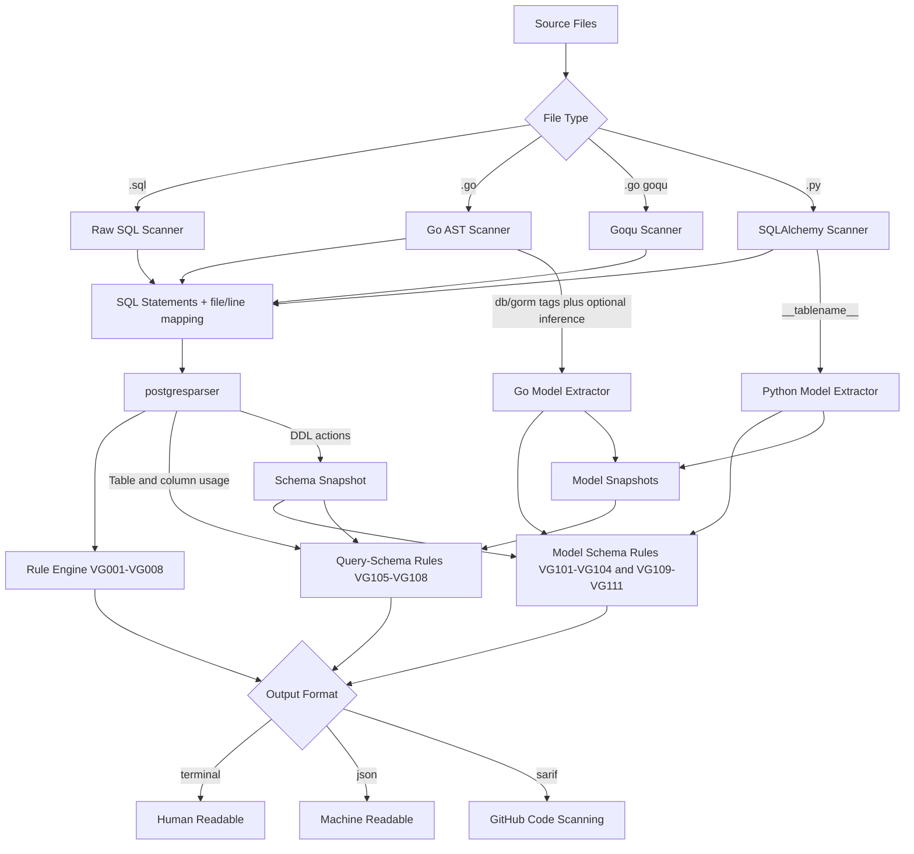

# Valk Guard

[](https://github.com/ValkDB/valk-guard/actions/workflows/ci.yml)
[](https://go.dev/)
[](LICENSE)
[](https://goreportcard.com/report/github.com/valkdb/valk-guard)
[](https://pkg.go.dev/github.com/valkdb/valk-guard)

**Catch SQL performance and safety issues before they hit production.**

Valk Guard scans your SQL, Go, and Python code for common database anti-patterns.
It runs in CI, gives clear feedback, and needs no database connection.

> **PostgreSQL only.** Valk Guard uses a PostgreSQL parser. MySQL, SQLite, and other SQL dialects are not supported.

---

## Quick Start

```bash
# Install
go install github.com/valkdb/valk-guard/cmd/valk-guard@latest

# Scan your project
valk-guard scan .

# See results as JSON
valk-guard scan . --format json

# Emit reviewdog-ready diagnostics
valk-guard scan . --format rdjsonl

# Export SARIF for GitHub Code Scanning
valk-guard scan . --format sarif --output results.sarif
```

That's it. Zero config required — all rules are enabled by default.

---

## What It Catches

Valk Guard ships with **19 rules** across three categories:

### Query Rules (VG001-VG008)

Structural checks on every SQL statement, regardless of source.

| Code  | Name                       | What it flags                                      | Severity |
|-------|----------------------------|----------------------------------------------------|----------|
| VG001 | select-star                | `SELECT *` projections                             | warning  |
| VG002 | missing-where-update       | `UPDATE` without `WHERE`                           | error    |
| VG003 | missing-where-delete       | `DELETE` without `WHERE`                           | error    |
| VG004 | unbounded-select           | `SELECT` without `LIMIT` (exempts aggregate-only and dual queries) | warning  |
| VG005 | like-leading-wildcard      | `LIKE`/`ILIKE` with leading `%`                    | warning  |
| VG006 | select-for-update-no-where | `SELECT ... FOR UPDATE` without `WHERE` (exempts queries with `LIMIT`) | error    |
| VG007 | destructive-ddl            | `DROP TABLE`, `TRUNCATE`, etc.                     | error    |
| VG008 | non-concurrent-index       | `CREATE INDEX` without `CONCURRENTLY`              | warning  |

### Schema-Drift Rules (VG101-VG104, VG109-VG111)

Cross-reference your ORM models against migration DDL to catch drift.

| Code  | Name                          | What it flags                                             | Severity |
|-------|-------------------------------|-----------------------------------------------------------|----------|
| VG101 | dropped-column                | Model references a column not in migrations               | error    |
| VG102 | missing-not-null              | NOT NULL column (no default) missing from model           | warning  |
| VG103 | type-mismatch                 | Column type mismatch between model and DDL                | warning  |
| VG104 | table-not-found               | Model table has no `CREATE TABLE` in migrations           | error    |
| VG109 | orphan-migration-table        | Migration table has no matching model                     | warning  |
| VG110 | duplicate-model-column-mapping| Model maps the same DB column twice                       | warning  |
| VG111 | go-inferred-table-name-risk   | Go model relies on inferred table name                    | warning  |

### Query-Schema Rules (VG105-VG108)

Validate that columns and tables referenced in queries actually exist in your schema.

| Code  | Name                         | What it flags                                          | Severity |
|-------|------------------------------|--------------------------------------------------------|----------|
| VG105 | unknown-projection-column    | `SELECT` references a column not in schema             | error    |
| VG106 | unknown-filter-column        | `WHERE`/`JOIN`/`GROUP BY`/`ORDER BY` uses unknown column | error  |
| VG107 | unknown-table-reference      | `FROM`/`JOIN` references a table not in schema         | error    |
| VG108 | ambiguous-unqualified-column | Unqualified column is ambiguous across joined tables   | warning  |

Full details and examples: [`docs/schema-drift.md`](docs/schema-drift.md)

---

## Installation

### Download a Binary (easiest)

Grab a pre-built binary from [GitHub Releases](https://github.com/ValkDB/valk-guard/releases) for Linux, macOS, or Windows (amd64/arm64).

### Install via Go

```bash
go install github.com/valkdb/valk-guard/cmd/valk-guard@latest
```

### Build From Source

```bash
git clone https://github.com/ValkDB/valk-guard.git
cd valk-guard
make build
make install
```

### Requirements

- **Go >= 1.25.6** for building from source
- **Python 3.x** only if you scan SQLAlchemy/Python files. No pip packages needed — Valk Guard ships an embedded Python script that uses only the standard library (`ast`, `json`). If `python3` is not on your `PATH`, Python scanning is skipped silently and non-Python rules still run normally.

---

## Supported Sources

Valk Guard understands SQL from multiple origins:

| Source              | What it scans                                                                 |
|---------------------|-------------------------------------------------------------------------------|
| **Raw SQL** (`.sql`) | Multi-statement files with comments, dollar-quoting, and nested block comments |
| **Go** (`go/ast`)    | SQL literals in `db.Query`, `db.Exec`, `db.QueryRow`, and context variants    |
| **Goqu**             | Builder chains (`From`/`Join`/`Where`/`Limit`/`ForUpdate`) and `goqu.L("...")` |
| **SQLAlchemy**       | ORM chains (`query`/`select`/`join`/`filter`) and `text("...")`/`.execute("...")` |

For schema-drift rules (VG101+), Valk Guard also extracts **model definitions**:
- **Go**: reads `db` and `gorm` struct tags; optionally infers field names.
- **Python**: reads `__tablename__` and `Column(...)` from SQLAlchemy models.

---

## Configuration

Create a `.valk-guard.yaml` to customize behavior:

```yaml
format: terminal

exclude:
  - "vendor/**"
  - "db/migrations/**"

go_model:
  mapping_mode: strict   # strict | balanced | permissive

rules:
  VG001:
    severity: warning
    engines: [all]       # all | sql | go | goqu | sqlalchemy
  VG007:
    enabled: false
```

Config controls:
- **`rules.<ID>.enabled`** — turn a rule on or off.
- **`rules.<ID>.severity`** — override to `error`, `warning`, or `info`.
- **`rules.<ID>.engines`** — restrict a rule to specific source engines.
- **`go_model.mapping_mode`** — `strict` (explicit tags only), `balanced` (infer exported fields), or `permissive` (infer all fields).
- **`exclude`** — glob patterns for files/paths to skip.

Reference example: [`.valk-guard.yaml.example`](.valk-guard.yaml.example)

### Exit Codes

| Code | Meaning |
|------|---------|
| `0`  | No findings |
| `1`  | Findings reported (any severity) |
| `2`  | Config, runtime, or parser error |

All findings — including `info` and `warning` — trigger exit code `1`. This lets CI treat any finding as actionable.

---

## Inline Suppression

Suppress individual findings with a comment directive on the line before the statement:

```sql
-- valk-guard:disable VG001
SELECT * FROM users;
```

```go
// valk-guard:disable VG001
db.Query("SELECT * FROM users")
```

```python
# valk-guard:disable VG001
session.execute(text("SELECT * FROM users"))
```

Disable all rules for the next statement:

```sql
-- valk-guard:disable
SELECT * FROM orders;
```

Full suppression guide: [`docs/suppression.md`](docs/suppression.md)

---

## CI / GitHub Actions

Valk Guard is designed for CI pipelines. Here's a minimal setup:

```yaml
permissions:
  contents: read
  pull-requests: write

jobs:
  pr-review:
    if: github.event_name == 'pull_request'
    steps:
      - uses: reviewdog/action-setup@v1

      - name: Run valk-guard
        run: |
          valk-guard scan "${files[@]}" --format rdjsonl > valk-guard.rdjsonl || exit_code=$?
          if [ "${exit_code:-0}" -gt 1 ]; then exit $exit_code; fi

      - name: Post review comments
        env:
          REVIEWDOG_GITHUB_API_TOKEN: ${{ secrets.GITHUB_TOKEN }}
        run: |
          reviewdog \
            -f=rdjsonl \
            -name="valk-guard" \
            -reporter=github-pr-review \
            -filter-mode=added \
            -fail-level=none \
            < valk-guard.rdjsonl
```

Findings (exit 1) are non-blocking for review comments. Config/parser failures (exit 2+) fail the job.

Full CI guide with reviewdog + SARIF upload: [`docs/ci-reviewer-mode.md`](docs/ci-reviewer-mode.md)

Output format reference: [`docs/output-formats.md`](docs/output-formats.md)

---

## How It Works



---

## Development

```bash
make build      # build binary
make test       # run tests (-race)
make lint       # golangci-lint
make cover      # coverage report
make check      # fmt + vet + lint + test
```

```bash
make run
# or
./valk-guard scan .
```

---

## Roadmap

- Deeper builder semantics (aliases, nested subqueries, richer predicate trees).
- Lock/index heuristics and additional schema-aware checks.
- SQLAlchemy 2.0 `mapped_column()` support for model extraction.
- Expanded custom rule authoring workflows.
- Stronger PR regression-gating modes (changed-files-only policies, severity gates).

---

## Contributing / Security / License

- Contributing: [`CONTRIBUTING.md`](CONTRIBUTING.md)
- Security: [`SECURITY.md`](SECURITY.md)
- License: [Apache 2.0](LICENSE)
