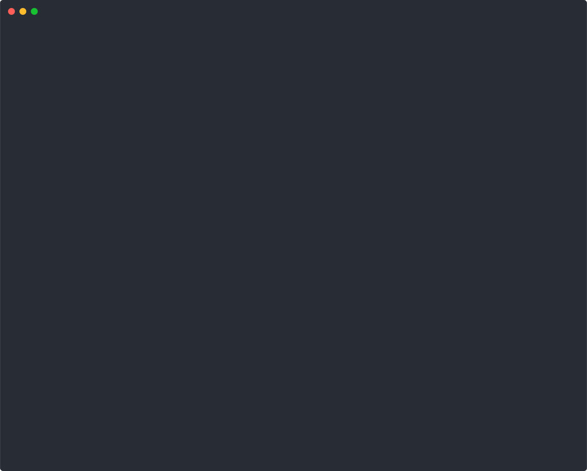
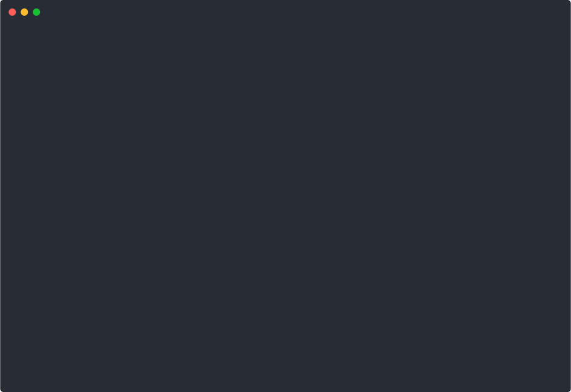
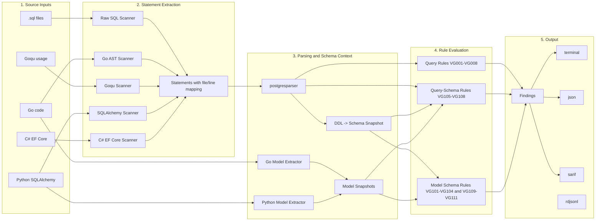

<p align="center">
  <h1 align="center">Valk Guard</h1>
  <p align="center">
    <strong>The SQL linter that catches production disasters at PR time.</strong>
  </p>
  <p align="center">
    <code>DELETE FROM orders</code> without a <code>WHERE</code>? <code>SELECT *</code> on a 50M-row table?<br/>
    Valk Guard finds them in your code — before your pager does at 3am.
  </p>
</p>

<p align="center">
  <a href="https://github.com/ValkDB/valk-guard/actions/workflows/ci.yml"></a>
  <a href="https://go.dev/"></a>
  <a href="LICENSE"></a>
  <a href="https://goreportcard.com/report/github.com/valkdb/valk-guard"></a>
  <a href="https://pkg.go.dev/github.com/valkdb/valk-guard"></a>
</p>

<p align="center">
  
</p>

---

## Why Valk Guard?

**Most SQL linters use regex and only see raw `.sql` files. Valk Guard parses real source structure instead.**

It reads Goqu builder chains, SQLAlchemy ORM calls, Go `db.Query` invocations, and C# EF Core `ExecuteSqlRaw` calls with source-aware scanners — Go and Python via AST, C# v1 via conservative text analysis of raw EF Core execution patterns. It synthesizes SQL from your ORM code, feeds it through a real PostgreSQL grammar, and runs every rule against it.

That means: if your ORM builds a `DELETE` without a `WHERE`, Valk Guard catches it — even though no raw SQL exists anywhere in your source.

| What it prevents | Example |
|---|---|
| Accidental mass updates | `UPDATE users SET active = false` (no WHERE) |
| Unbounded queries | `SELECT id, email FROM users` (no LIMIT) |
| Index-killing patterns | `WHERE email LIKE '%@gmail.com'` |
| Dangerous migrations | `DROP TABLE`, `CREATE INDEX` without `CONCURRENTLY` |
| Schema drift | ORM model says `email` exists, but migration dropped it |
| ORM footguns | `session.query(User).delete()` — no raw SQL, still caught |

**Zero config. No database connection. Runs in CI in seconds.**

> **PostgreSQL only.** Valk Guard uses a PostgreSQL parser. MySQL, SQLite, and other dialects are not supported.

---

## Quick Start

```bash
# Install
go install github.com/valkdb/valk-guard/cmd/valk-guard@latest

# If this is your first Go-installed CLI, add the Go bin dir to PATH.
# Default location: $(go env GOPATH)/bin
export PATH="$(go env GOPATH)/bin:$PATH"

# Scan your project
valk-guard scan .

# Scan only a specific folder
valk-guard scan ./migrations

# Scan only a specific file
valk-guard scan ./queries/report.sql

# JSON for CI pipelines
valk-guard scan . --format json

# Reviewdog PR comments
valk-guard scan . --format rdjsonl

# GitHub Code Scanning (SARIF)
valk-guard scan . --format sarif --output results.sarif
```

That's it. All 19 rules are enabled by default.

Pass one or more paths to scan only part of a repo:

```bash
valk-guard scan ./migrations
valk-guard scan ./queries/report.sql
valk-guard scan ./migrations ./internal
```

---

## What It Catches

Valk Guard ships with **19 rules** across three categories. Here are the highlights:

| Rule | What it catches | Severity |
|------|----------------|----------|
| VG002 | `UPDATE` without `WHERE` — may wipe entire tables | error |
| VG003 | `DELETE` without `WHERE` — same, but worse | error |
| VG007 | `DROP TABLE`, `TRUNCATE` in application code | error |
| VG001 | `SELECT *` — over-fetching columns | warning |
| VG005 | `LIKE '%...'` — leading wildcard kills indexes | warning |
| VG008 | `CREATE INDEX` without `CONCURRENTLY` — blocks writes | warning |
| VG101 | ORM model references a column that migrations dropped | error |
| VG105 | Query `SELECT`s a column that doesn't exist in schema | error |

**[See all 19 rules](docs/rules.md)** with full descriptions, examples, and severity levels.

---

## Not Regex — Source-Aware Analysis

Most SQL linters use regex. Valk Guard **walks real source structure** instead. It compiles and walks the actual AST of your Go and Python code, and for C# v1 it uses conservative text analysis of EF Core raw SQL execution calls. It understands ORM builder chains and raw execution APIs as first-class SQL sources — no `.sql` file required.

<table>
<tr>
<td width="50%">

**Go + Goqu** — walks builder chains via `go/ast`

</td>
<td width="50%">

**Python + SQLAlchemy** — parses ORM chains via Python AST

</td>
</tr>
<tr>
<td>



</td>
<td>


</td>
</tr>
</table>

No raw SQL in those files. Valk Guard synthesizes SQL from the ORM calls, parses it with a PostgreSQL grammar, and runs all 19 rules against it (a handful of checks use targeted regex on parser-extracted clauses when the AST doesn't expose the needed field; Go/Python source scanning is AST-based, while C# v1 uses conservative text analysis for EF Core raw SQL execution).

| Source | How it works |
|--------|-------------|
| **Raw SQL** (`.sql`) | Multi-statement parser with dollar-quoting, nested block comments |
| **Go** (`go/ast`) | Extracts SQL from `db.Query`, `db.Exec`, `db.QueryRow` and context variants |
| **Goqu** | Walks builder chains (`From`/`Join`/`Where`/`Limit`/`ForUpdate`) via Go AST |
| **SQLAlchemy** | Parses ORM chains (`query`/`select`/`join`/`filter`) via Python AST |
| **C# (EF Core)** | Extracts SQL from `ExecuteSqlRaw`, `ExecuteSqlInterpolated` and async variants via conservative text analysis |

For schema-drift rules (VG101+), it also reads **ORM model definitions** — Go struct tags (`db`, `gorm`) and Python `__tablename__` / `Column(...)` — and cross-references them against your migration DDL.

> **C# note:** v1 covers raw EF Core SQL execution only (`ExecuteSqlRaw`, `ExecuteSqlInterpolated`, and async variants). Query-builder and LINQ patterns are tracked separately.

---

## How It Compares

| | Valk Guard | SQL formatters/linters | DB-connected advisors | Schema-only drift checks |
|---|---|---|---|---|
| **Needs a running database** | No | Usually no | Usually yes | Usually no |
| **Scans app source (`.go`, `.py`, `.cs`)** | Yes | Rarely | No | Rarely |
| **Understands ORM/query builders** | Yes | Rarely | No | Sometimes |
| **Checks schema drift against models** | Yes | Rarely | Sometimes | Yes |
| **Fits PR review workflows** | Yes | Often | Sometimes | Often |
| **Auto-fixes SQL** | No | Sometimes | No | No |
| **Dialect coverage** | PostgreSQL only | Often multi-dialect | Varies | Varies |
| **Primary value** | SQL + ORM static analysis | SQL style and formatting | Live query/runtime insights | Migration/model consistency |

Valk Guard's niche: **static analysis across SQL + ORM code with schema-drift detection, no infrastructure required.**

---

## CI / GitHub Actions

Valk Guard is built for CI. This is the minimal full-repo reviewer step; use the copy-paste workflows below for complete jobs:

```yaml
permissions:
  contents: read
  pull-requests: write

jobs:
  pr-review:
    if: github.event_name == 'pull_request'
    steps:
      - uses: reviewdog/action-setup@v1

      - name: Run valk-guard
        run: |
          set +e
          valk-guard scan . --config .valk-guard.yaml --format rdjsonl > valk-guard.rdjsonl
          code=$?
          set -e

          if [ "$code" -gt 1 ]; then
            exit "$code"
          fi

      - name: Post review comments
        env:
          REVIEWDOG_GITHUB_API_TOKEN: ${{ secrets.GITHUB_TOKEN }}
        run: |
          reviewdog \
            -f=rdjsonl \
            -name="valk-guard" \
            -reporter=github-pr-review \
            -filter-mode=added \
            -fail-level=none \
            < valk-guard.rdjsonl
```

Findings (exit 1) are non-blocking. Config/parser errors (exit 2+) fail the job.

Copy-paste workflows:
- [Full-repo PR scan](docs/ci-example-full-scan.md)
- [Changed-files-only PR scan](docs/ci-example-changed-files.md)
- [Full guide with SARIF + reviewdog + JSON artifacts](docs/ci-reviewer-mode.md)

---

## Live Demo PRs

See valk-guard reviewing real code in [`ValkDB/valk-guard-example`](https://github.com/ValkDB/valk-guard-example):

- [Query rules (SELECT *, missing WHERE, unbounded queries)](https://github.com/ValkDB/valk-guard-example/pull/2)
- [Index and locking rules (leading wildcard, FOR UPDATE)](https://github.com/ValkDB/valk-guard-example/pull/3)
- [Schema-drift and DDL rules](https://github.com/ValkDB/valk-guard-example/pull/4)
- [Query-schema validation (unknown columns/tables)](https://github.com/ValkDB/valk-guard-example/pull/5)
- [Suppression showcase (inline + global config)](https://github.com/ValkDB/valk-guard-example/pull/6)

---

## Installation

### Download a Binary (easiest)

Grab a pre-built binary from [GitHub Releases](https://github.com/ValkDB/valk-guard/releases) for Linux, macOS, or Windows (amd64/arm64).

### Install via Go

```bash
go install github.com/valkdb/valk-guard/cmd/valk-guard@latest
```

If `valk-guard` is still not found, the install likely succeeded but your Go bin directory is not on `PATH` yet.

macOS / Linux:

```bash
export PATH="$(go env GOPATH)/bin:$PATH"
```

Windows PowerShell:

```powershell
$env:Path += ";$(go env GOPATH)\bin"
```

If you use `GOBIN`, add that directory instead of `$(go env GOPATH)/bin`.

### Pin in CI (recommended)

```bash
go install github.com/valkdb/valk-guard/cmd/valk-guard@vX.Y.Z
```

Why pin: avoids surprise behavior changes, keeps output processing stable, makes builds reproducible.

### Build From Source

```bash
git clone https://github.com/ValkDB/valk-guard.git
cd valk-guard
make build

# Try the built-in sample inputs in this repo.
# These intentionally produce findings, so exit code 1 is expected.
./valk-guard scan testdata/sql
./valk-guard scan testdata/python

# Or scan the whole repo / a specific path in your own project.
./valk-guard scan .
./valk-guard scan ./path/to/folder
./valk-guard scan ./path/to/file.sql

# Optional: install into GOBIN or $(go env GOPATH)/bin
make install
```

### Requirements

- **Go >= 1.25.8** for building from source
- **Python >= 3.6** only when scanning `.py` files for SQLAlchemy usage. No pip packages needed — Valk Guard ships an embedded script using only stdlib (`ast`, `json`). If scanned `.py` files are present and `python3` is missing or too old, the scan fails fast with an error.
- **No external runtime** for C# scanning — the EF Core scanner is a pure Go text-based analyzer, no .NET SDK required.

---

## Configuration

Zero config works out of the box. To customize, create a `.valk-guard.yaml`:

```yaml
exclude:
  - "vendor/**"
  - "generated/**"

# Optional: override which SQL files build the schema snapshot.
# If omitted, Valk Guard uses these defaults:
#   migrations/, migration/, migrate/
migration_paths:
  - "db/migrations"
  - "schema/**/*.sql"

rules:
  VG001:
    severity: warning
    engines: [all]       # all | sql | go | goqu | sqlalchemy | csharp
  VG007:
    enabled: false

go_model:
  mapping_mode: strict   # strict | balanced | permissive
```

Reference: [`.valk-guard.yaml.example`](.valk-guard.yaml.example)

### Inline Suppression

```sql
-- valk-guard:disable VG001
SELECT * FROM users;
```

Works in Go (`//`), Python (`#`), and C# (`//`) too. Full guide: [`docs/suppression.md`](docs/suppression.md)

### Exit Codes

| Code | Meaning |
|------|---------|
| `0`  | No findings |
| `1`  | Findings reported (any severity) |
| `2`  | Config, runtime, or parser error |

---

## How It Works



---

## Roadmap

Track progress and vote on what matters to you:

- C# EF Core query-builder support — `FromSqlRaw`, `SqlQueryRaw`, LINQ patterns
- GORM scanner — AST-based scanning for GORM builder chains and model extraction
- Deeper builder semantics — aliases, nested subqueries, richer predicate trees
- SQLAlchemy 2.0 `mapped_column()` support — modern model extraction
- Custom rule authoring — define your own rules in YAML or Go
- Severity-gated CI — block PRs only on errors, not warnings

---

## Documentation

- [All 19 rules — full reference](docs/rules.md)
- [Schema-drift detection](docs/schema-drift.md)
- [Suppression and noise control](docs/suppression.md)
- [Output formats (terminal, JSON, rdjsonl, SARIF)](docs/output-formats.md)
- [CI reviewer mode](docs/ci-reviewer-mode.md)
- [Adding new rules](docs/adding-rules.md)
- [Adding new scanners/sources](docs/adding-sources.md)

---

## Development

```bash
make build      # build binary
make test       # run tests (-race)
make lint       # golangci-lint
make cover      # coverage report
make check      # fmt + vet + lint + test
```

---

## Contributing / Security / License

- Contributing: [`CONTRIBUTING.md`](CONTRIBUTING.md)
- Security: [`SECURITY.md`](SECURITY.md) | [Report a vulnerability](https://github.com/ValkDB/valk-guard/security/advisories/new)
- License: [Apache 2.0](LICENSE)
