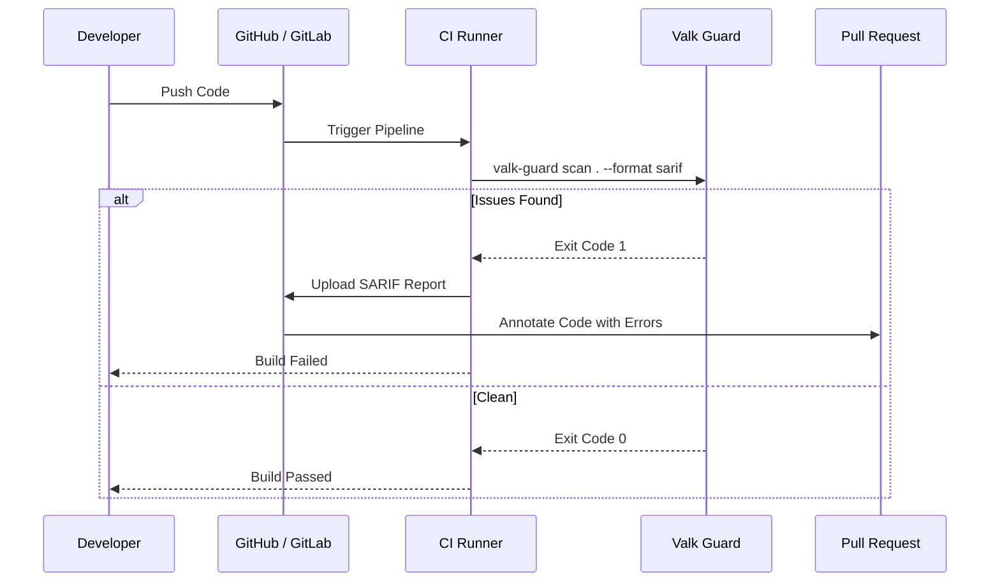

# Valk Guard

[](https://github.com/ValkDB/valk-guard/actions)
[](https://go.dev/)
[](https://opensource.org/licenses/Apache-2.0)

**Open-source database performance linter for CI/CD. Statically analyzes SQL in source code and flags performance anti-patterns before they hit production.**

---

> **Early Development** -- Core linting is active with built-in rules `VG001` through `VG008`. Contributions for additional rules and scanners are welcome.

---

## What It Does

Valk Guard scans your codebase for SQL -- raw `.sql` files, SQL strings embedded in Go source code, and Python SQLAlchemy usage. Each SQL statement is parsed into structured metadata using [postgresparser](https://github.com/ValkDB/postgresparser) (an ANTLR4-based PostgreSQL grammar), then checked against a set of lint rules that catch common performance and safety anti-patterns. Findings are reported as colored terminal output, JSON, or SARIF 2.1.0 for integration with GitHub Code Scanning.

The goal: catch `SELECT *`, missing `WHERE` clauses, unbounded queries, destructive DDL, and other database footguns in CI before they reach production.

## Features (What We Support Today)

The CLI scaffold, scanning pipeline, reporting layer, and initial rules are implemented:

- **Raw SQL file scanning** (`.sql`) with full awareness of quoted strings, dollar-quoting, line comments (`--`), and block comments (`/* */`)
- **Go source scanning** -- extracts SQL string literals from `db.Query`, `db.Exec`, `db.QueryRow`, `db.Prepare`, and other common database method calls via `go/ast`
- **Goqu scanning** -- extracts raw SQL (`goqu.L("...")`) and generates synthetic SQL from query-builder AST chains (joins, where predicates, limit/update/delete structure)
- **Python SQLAlchemy scanning** -- extracts raw SQL (`text("...")`, `.execute("...")`) and generates synthetic SQL from ORM/query-builder AST chains (`query/select/join/filter/update/delete`)
- **PostgreSQL dialect parsing** via [postgresparser](https://github.com/ValkDB/postgresparser) (ANTLR4 grammar)
- **Three output formats**: terminal (colored), JSON, SARIF 2.1.0
- **Inline disable directives** -- `-- valk-guard:disable VG001` in SQL, `// valk-guard:disable VG001` in Go, `# valk-guard:disable VG001` in Python
- **Per-rule configuration** via `.valk-guard.yaml` (enable/disable individual rules, override severity)
- **File exclusion patterns** with glob support (including `**` for recursive matching)
- **Structured logging via `log/slog`** with `--log-level` (`debug|info|warn|error`)
- **Parallel scanner execution** across SQL, Go, Goqu, and SQLAlchemy inputs
- **End-to-end context cancellation** (graceful `Ctrl+C` handling and timeout-friendly CI behavior)
- **`--output` flag** to write results directly to a file
- **Strict parsing/AST behavior**: invalid SQL and unparseable Go/Python source fail the scan with exit code `2`
- **Exit codes**: `0` = clean, `1` = findings, `2` = config/runtime error

**Current status:** Rules `VG001` through `VG008` are implemented.

## Installation

Build from source.

Requirements:

- Go 1.25.6+
- Python 3 (only required when scanning Python/SQLAlchemy code)

```bash
go get github.com/valkdb/postgresparser@v1
```

Then:

```bash
git clone https://github.com/ValkDB/valk-guard.git
cd valk-guard
make build        # produces ./valk-guard binary
make install      # installs to $GOPATH/bin
```

## Quick Start

```bash
# Scan the current directory
valk-guard scan .

# Scan specific paths
valk-guard scan ./sql/ ./internal/

# Output as JSON
valk-guard scan . --format json

# Output as SARIF (for GitHub Code Scanning)
valk-guard scan . --format sarif

# Use a custom config file
valk-guard scan . --config .valk-guard.yaml

# Enable debug logs
valk-guard scan . --log-level debug

# Write results to a file
valk-guard scan . --format sarif --output results.sarif
```

## Examples

Check the [examples/](examples/) directory for sample code in SQL, Go (standard + Goqu), and Python (SQLAlchemy).

## Architecture

```mermaid
graph TD
    subgraph "CLI Entry Point"
        CLI[valk-guard scan] --> Config[Load Config]
    end

    subgraph "Scanners"
        Config --> Scanners{Active Scanners}
        Scanners -->|Scanner| SQLScanner[Raw SQL Scanner]
        Scanners -->|Scanner| GoScanner[Go AST Scanner]
        Scanners -->|Scanner| GoquScanner[Goqu AST Scanner]
        Scanners -->|Scanner| PyScanner[SQLAlchemy Scanner]
    end

    subgraph "Analysis Engine"
        SQLScanner -->|Extracts| SQL[SQL Statements]
        GoScanner -->|Extracts| SQL
        GoquScanner -->|Synthesizes| SQL
        PyScanner -->|Synthesizes| SQL
        
        SQL --> Parser[postgresparser]
        Parser --> AST[Postgres AST]
        
        AST --> Rules[Rule Engine]
        Rules --> Findings[Findings List]
    end

    subgraph "Reporting"
        Findings --> Reporters{Format}
        Reporters -->|Default| Term[Terminal Output]
        Reporters -->|--format json| JSON[JSON Report]
        Reporters -->|--format sarif| SARIF[SARIF Report]
    end
```

## CI / GitHub Actions

Valk Guard is designed to integrate seamlessly into your CI/CD pipeline. By outputting **SARIF**, it can feed findings directly into GitHub Code Scanning, allowing you to see errors inline on your Pull Requests.



### Sample Workflow

Here is a robust GitHub Actions configuration that installs the tool, runs it, and uploads the results.

```yaml
name: DB Linter

on: [push, pull_request]

permissions:
  contents: read
  security-events: write # Required to upload SARIF results

jobs:
  valk-guard:
    runs-on: ubuntu-latest
    steps:
      - uses: actions/checkout@v4

      - name: Set up Go
        uses: actions/setup-go@v5
        with:
          go-version: '1.25'

      - name: Install Valk Guard
        run: go install github.com/valkdb/valk-guard/cmd/valk-guard@latest

      - name: Run Linter
        continue-on-error: true # Let the SARIF upload step happen even if issues are found
        run: valk-guard scan . --format sarif --output valk-guard.sarif

      - name: Upload SARIF file
        uses: github/codeql-action/upload-sarif@v3
        with:
          sarif_file: valk-guard.sarif
```

## How It Works

```
valk-guard scan [paths...]
        |
        v
+-------------------------+     Finds SQL in:
|  Scanner                |     - *.sql files (RawSQLScanner)
|                         |     - Go source (GoScanner via go/ast)
|                         |     - Goqu (GoquScanner)
|                         |     - Python SQLAlchemy (SQLAlchemyScanner)
+--------+----------------+
         |
         v
+-------------------------+
|  Parser Engine          |     Parses each SQL statement into
|  (postgresparser) |     structured metadata
+--------+----------------+
         |
         v
+-------------------------+
|  Rule Engine            |     Checks parsed metadata against
|  (VG001-VG008 active)   |     enabled lint rules
+--------+----------------+
         |
         v
+-------------------------+     Output formats:
|  Reporter               |     - Terminal (colored)
|                         |     - JSON
|                         |     - SARIF 2.1.0
+-------------------------+

Exit code: 0 = clean, 1 = findings, 2 = config/runtime error
```

## Scanners

**Raw SQL Scanner** -- Splits `.sql` files on `;` with full awareness of quoted strings, dollar-quoting (`$$...$$`), line comments (`--`), and block comments (`/* */`). Each extracted statement is mapped back to its source file and line number.

**Go Scanner** -- Walks Go source files using `go/ast` and extracts SQL string literals from database method calls: `Query`, `QueryRow`, `Exec`, `QueryContext`, `ExecContext`, `QueryRowContext`, `Prepare`, `Get`, `Select`, `MustExec`, `NamedExec`, `NamedQuery`. Supports inline disable comments on the line above the call.

**Goqu Scanner** -- Extracts raw SQL from `goqu.L("...")` and synthesizes SQL from goqu method chains (for example `From/Join/Where/Limit/Update/Delete`) so rule checks can run even when no raw SQL literal exists. Synthetic output is marked with `/* valk-guard:synthetic goqu-ast */`. Import-gated: files without a goqu import are skipped. Located in `internal/scanner/goqu/`.

**SQLAlchemy Scanner** -- Extracts SQL from `text("...")` and `.execute("...")` calls in Python `.py` files, and also synthesizes SQL from ORM/query-builder chains (`query/select/join/filter/filter_by/update/delete`). Synthetic output is marked with `/* valk-guard:synthetic sqlalchemy-ast */`. Uses `# valk-guard:disable` directives for inline suppression. Located in `internal/scanner/sqlalchemy/`.

## Configuration

Rules are configured per-project via `.valk-guard.yaml`:

```yaml
version: 1

# Per-rule overrides
rules:
  VG001:
    enabled: true
    severity: warning
  VG004:
    enabled: false

# File patterns to exclude from scanning (supports ** globs)
exclude:
  - "tests/**"
  - "migrations/seed_*.sql"
  - "vendor/*"
  - "*.gen.sql"
```

### Inline Suppression

Suppress findings for individual statements using disable directives.

In SQL files:

```sql
-- valk-guard:disable VG001
SELECT * FROM users;

-- valk-guard:disable VG002,VG003
UPDATE users SET active = false;

-- valk-guard:disable
SELECT * FROM orders;  -- disables all rules for the next statement
```

In Go files:

```go
// valk-guard:disable VG001
db.Query("SELECT * FROM users")
```

In Python files:

```python
# valk-guard:disable VG001
session.execute(text("SELECT * FROM users"))
```

## Built-in Rules

| Rule  | Name                       | What it catches                          | Default Severity |
|-------|----------------------------|------------------------------------------|------------------|
| VG001 | select-star                | `SELECT *` in application code           | warning          |
| VG002 | missing-where-update       | `UPDATE` without `WHERE`                 | error            |
| VG003 | missing-where-delete       | `DELETE` without `WHERE`                 | error            |
| VG004 | unbounded-select           | `SELECT` without `LIMIT`                 | warning          |
| VG005 | like-leading-wildcard      | `LIKE '%...'` leading wildcard           | warning          |
| VG006 | select-for-update-no-where | `SELECT FOR UPDATE` without `WHERE`      | error            |
| VG007 | destructive-ddl            | `DROP TABLE`, `DROP COLUMN`, `TRUNCATE`  | error            |
| VG008 | non-concurrent-index       | `CREATE INDEX` without `CONCURRENTLY`    | warning          |

## Future / Roadmap

**Next**: Expand scanner coverage with deeper builder semantics (aliases, nested subqueries, richer predicate trees) and add more advanced rules (schema-aware checks, lock/index heuristics).

**Then**: GitHub Action for PR annotations. Use SARIF output to surface findings directly in pull request diffs.

**Later**: Schema-aware analysis (connect to a live or dumped schema for smarter linting), and custom rule authoring (let users define project-specific rules).

## Development

```bash
make check        # fmt + vet + lint + test (runs all checks)
make test         # run tests with -race
make test-v       # run tests with -race -v (verbose)
make cover        # generate coverage report
make lint         # golangci-lint
make build        # build binary
make install      # install to $GOPATH/bin
make clean        # remove binary and coverage artifacts
make tidy         # go mod tidy
make fmt          # gofmt + goimports
make vet          # go vet
```

## Contributing

See [CONTRIBUTING.md](CONTRIBUTING.md) for guidelines on reporting issues, submitting pull requests, and setting up a development environment.
Community behavior standards are documented in [CODE_OF_CONDUCT.md](CODE_OF_CONDUCT.md).

## License

Apache 2.0 -- see [LICENSE](LICENSE) for the full text.
